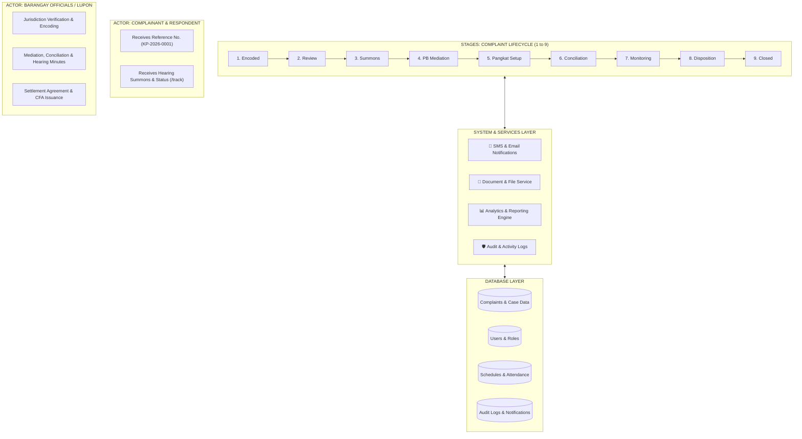
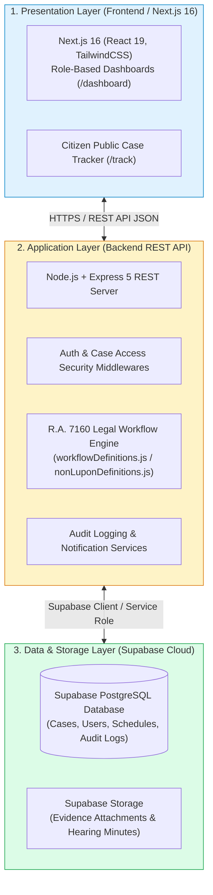

# KatarunganHub — Final System Architecture, Workflow Engine & Conceptual Framework
*(Based on Strict R.A. 7160 Katarungang Pambarangay Law)*

**Project Name:** KatarunganHub  
**Module:** Katarungang Pambarangay (KP) System Architecture & Workflow Engine Specification  
**Document Type:** Final Academic Submission Guide (System Workflow, Architecture, Conceptual Framework)  

---

## 1. Master Workflow Engine Diagram (Complaint Lifecycle & Process Flow)

---

## 2. Conceptual Framework Diagram (Input - Process - Output / IPO Model)

```mermaid
flowchart LR
    subgraph INPUT ["1. INPUT"]
        direction TB
        I1["• Complaint Details & Incident Notes"]
        I2["• Complainant & Respondent Profiles"]
        I3["• User Credentials & Roles (6 Roles)"]
        I4["• Statutory Rules (R.A. 7160 / KP Law)"]
    end

    subgraph PROCESS ["2. PROCESS (System Core & Engine)"]
        direction TB
        P1["• RBAC Authentication & Middleware Security"]
        P2["• Lupon Workflow State Engine (9 Stages)"]
        P3["• Non-Lupon Workflow Engine (5 Stages)"]
        P4["• Hearing Schedule & Summons Handler"]
        P5["• Real-time Audit Logger (logAudit)"]
        P6["• Notification Dispatcher (notify)"]
    end

    subgraph OUTPUT ["3. OUTPUT"]
        direction TB
        O1["• Official Case Records & Ref No. (KP-YYYY-XXXX)"]
        O2["• Official Summons & Attendance Minutes"]
        O3["• Amicable Settlement Agreements (KP Form 16/17)"]
        O4["• Certificate to File Action / CFA (KP Form 20)"]
        O5["• Citizen Case Tracker Status (/track)"]
        O6["• Analytics & Compliance Reports"]
    end

    INPUT --> PROCESS --> OUTPUT
```

---

## 3. System Architecture Diagram (3-Tier Monorepo Web Architecture)

---

## 4. Stage-by-Stage Explanation (For Paper & Defense Presentation)

| Stage # | Stage Name | Primary Actor | Detailed Description & Legal Action | Next Outcomes |
| :---: | :--- | :--- | :--- | :--- |
| **1** | **Official Complaint Encoded** | Lupon Secretary | Walk-in complaint recorded in system. System assigns a unique Reference Number (e.g., `KP-2026-0001`). | For jurisdiction review |
| **2** | **Jurisdiction Review** | Punong Barangay, Secretary | Verification if complaint falls under R.A. 7160 jurisdiction (Section 408/409). | Potentially covered Potentially not covered Referred |
| **3** | **Summons Issued** | Punong Barangay, Secretary | Generation and serving of official Summons Notice to Respondent for 1st hearing. | Proceed to mediation Rescheduled |
| **4** | **Punong Barangay Mediation** | Punong Barangay | **1st Legal Stage:** 15-day mandatory mediation hearing conducted personally by Punong Barangay. | Settlement reached No settlement Voluntary arbitration |
| **5** | **Pangkat Formation** | Punong Barangay, Secretary | Constitution of 3-member *Pangkat Tagapagkasundo* conciliation panel from Lupon roster. | Pangkat formed |
| **6** | **Pangkat Conciliation** | Lupon / Pangkat Members | **2nd Legal Stage:** 15-day conciliation hearings conducted by assigned 3 Pangkat members. | Settlement reached Conciliation failed |
| **7** | **Settlement Monitoring** | Lupon Secretary | Mandatory 30-day compliance tracking period for signed Amicable Settlement Agreements. | Settlement complied Execution requested |
| **8** | **Proper Disposition** | Punong Barangay, Secretary | Preparation of official legal documents: Certificate to File Action (CFA) or Final Resolution. | Ready for closure |
| **9** | **Closed** | System State / Admin | Final archived state in system database. | End of Workflow |

---

## 5. Role Access Control Matrix (RBAC)

| Role | Access Level | Responsibilities & System Actions |
| :--- | :--- | :--- |
| **System Administrator** | Master Access | Audit logs review, user management, system configuration. |
| **Punong Barangay** | Executive Authority | Jurisdiction review, summons authorization, 1st-stage Mediation, Pangkat constitution, CFA signature. |
| **Barangay / Lupon Secretary** | Operational Lead | Encoding complaints, issuing summons, scheduling hearings, attendance tracking, 30-day monitoring. |
| **Lupon / Pangkat Member** | Conciliation Officer | Conducting 2nd-stage Conciliation hearings, logging hearing minutes. |
| **Complainant** | Citizen Access | Viewing filed cases, tracking stage progress, hearing notifications. |
| **Respondent** | Citizen Access | Viewing respondent notice, checking summons schedule & hearing updates. |

---

*Document prepared for KatarunganHub System Documentation and Academic Defense Papers.*
